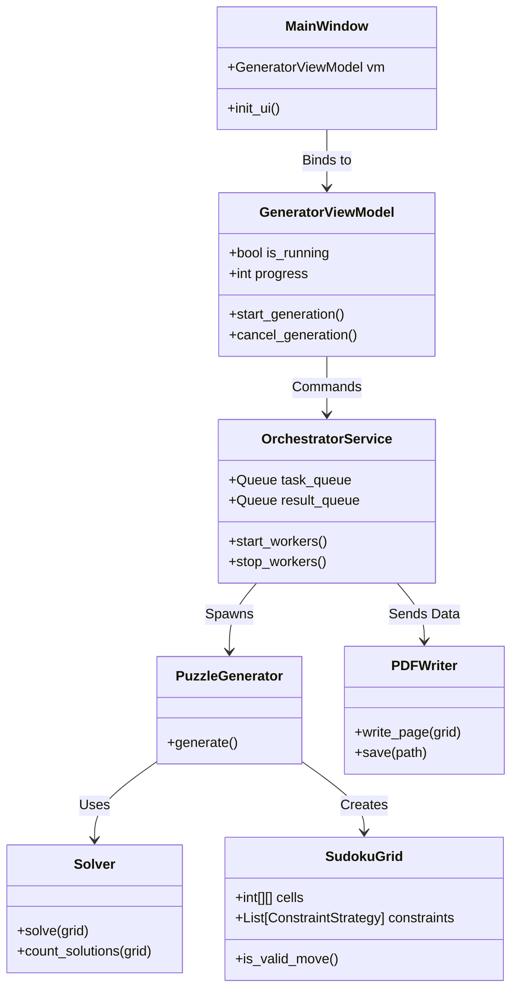

# SudokuMaster Gen - Project Plan

## 1. Goal
To develop **SudokuMaster Gen**, a high-performance, desktop-based Sudoku generator application. The system will use **MVVM architecture** and **multiprocessing** to ensure a responsive UI while performing heavy computational tasks. It will support mass production of various Sudoku types (Classic, Jigsaw, Diagonal) and export them to PDF.

## 2. Roadmap

### Phase 1: Core Logic & Models (The Brain)
*   **Objective:** Implement the fundamental data structures and algorithms for Sudoku generation and solving.
*   **Deliverables:** `SudokuGrid`, `SudokuSolver`, `PuzzleGenerator`, `ConstraintStrategy`.
*   **Status:** **COMPLETED** (Refactored to match Master Blueprint).

### Phase 2: Infrastructure & Services (The Engine)
*   **Objective:** Set up the multiprocessing framework, logging, and file management.
*   **Deliverables:** `OrchestratorService`, `Worker` logic, `LoggerService`, `FileManager`.
*   **Status:** **IN PROGRESS**.

### Phase 3: MVVM & UI (The Interface)
*   **Objective:** Build the user interface using PySide6 and connect it to the core logic via ViewModels.
*   **Deliverables:** `MainWindow`, `GeneratorViewModel`, Data Binding implementation.
*   **Status:** Pending.

### Phase 4: Advanced Features (The Skills)
*   **Objective:** Implement complex Sudoku types and PDF export.
*   **Deliverables:** `JigsawStrategy`, `GeometryFactory`, `PDFWriter`.
*   **Status:** Pending.

### Phase 5: Optimization & Mass Production (The Factory)
*   **Objective:** Optimize for speed and handle batch generation.
*   **Deliverables:** Batch processing logic, Caching mechanisms, Memory management.
*   **Status:** Pending.

## 3. Action Plan

### Phase 1: Core Logic (Completed)
1.  **Define Models:** Created `app/models/grid.py` (SudokuGrid) and `app/models/settings.py` (GenerationConfig).
2.  **Implement Constraints:** Created `app/models/constraints.py` (DiagonalConstraint, etc.).
3.  **Implement Solver:** Created `app/core/solver.py` with backtracking and constraint checking.
4.  **Implement Generator:** Created `app/core/factory.py` (PuzzleGenerator).
5.  **Unit Testing:** Verified with `tests/test_core.py`.

### Phase 2: Infrastructure (Current)
1.  **Logging:** Implement `app/services/logger.py`.
2.  **Orchestrator:** Create `app/services/orchestrator.py` to manage `multiprocessing.Pool`.
3.  **Worker Logic:** Define the worker function that runs in separate processes.

### Phase 3: UI & MVVM
1.  **ViewModel Base:** Create `app/mvvm/viewmodels/base_vm.py`.
2.  **Generator VM:** Implement `app/mvvm/viewmodels/generator_vm.py`.
3.  **Main Window:** Design `app/mvvm/views/main_window.py` using PySide6.
4.  **Binding:** Connect UI signals/slots to ViewModel properties.

### Phase 4: Advanced & Export
1.  **PDF Writer:** Implement `app/services/pdf_writer.py` using `reportlab`.
2.  **Jigsaw Logic:** Implement `app/core/geometry.py` and `app/core/transformer.py`.

## 4. Technical Specifications

### Tech Stack
*   **Language:** Python 3.12+
*   **GUI Framework:** PySide6 (Qt for Python).
*   **PDF Generation:** ReportLab.
*   **Computation:** `multiprocessing`.

### System Design (Class Diagram Concept)

## 5. Developer Notes
*   **Virtual Environment:** Always activate `D:\dev\MTSudokuGeneratorPro\Scripts\activate.bat` before running.
*   **Code Style:** Follow PEP 8.
*   **Git:** Commit often. Push to `origin main`.
